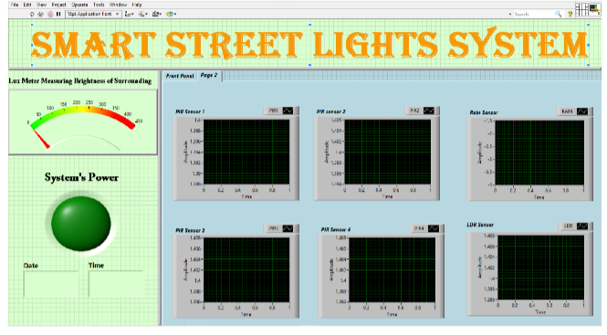

# Instrumentation Project
This project is one of the coursework required by our department under the course Instrumentation and Measurement Technique. The task given was to create a prototype using any sensors and NI-USB-6008 data logger. 

## Project Details

### Project Title
Automated Street Lights' System

### Objective
To purpose a new street lights system with a better energy saving system to replace the existing one

### Hardware Selection
1. Light Dependent Resistor (LDR sensor)
2. Passive Infrared Sensor (PIR sensor)
3. Rain Sensor
4. National Instrument USB-6008 Data Logger

### Software Used
LabVIEW

### Project's Background
In order to minimize the energy usage on street lights, a working prototype demonstrating the automated street lights system was built. How does it works? In the prototype, 5 street lights were built using LEDs and then the PIR sensors were put at the side of each street lights. When the PIR sensors detected motion of vehicle passing by, the signal would trigger the LEDs. However, the LEDs should be triggered only when the surrounding's light intensity was lower than the threshold value. In order to this, LDR sensor was added on top of one of the street light. Then the system was programmed to turn on the street lights only when the surrounding was dark and there were cars passing by. There are a lot of problems regarding the visibility on read when it is raining heavily. Therefore, in this project, a rain sensor was used to detect rain, and if rain was detected, the street lights system would increase the intensity of the LEDs so that drivers could have a better visibility. In this project, a second LED was used to demonstrate the increased intensity. Below are diagrams of the block diagram of the system, front panel of the system, videos showcasing the system and also some pictures of the set-up.

#### LabVIEW Block Diagram of the system

#### Front Panel of the system

#### Videos demonstrating the syste,
1. The video in [this](https://www.youtube.com/watch?v=p90MB6ILn4E&feature=youtu.be) link is demonstrating the condition when it is raining on the highway and there is car passing by the street lights. As a result, both LEDs are lighted up to have an increased light intensity in the raining condition.
2. The video in [this](https://www.youtube.com/watch?v=YJaCJHp4dg4) link is demonstrating the condition when it is not raining on the highway and there is car passing by the street lights. As a result, only one LEDs are lighted up for each street light.

#### Pictures related to the projects

##### Prototype of the system

##### NI USB-6008 date logger connected to sensors

## Conclusion
Finally, I would like to thank all of my team members because without the teamwork it would be impossible to finish this project on time. This is my first time using LabVIEW and there are a lot more things I have to learn in order to make the projects more efficient.
